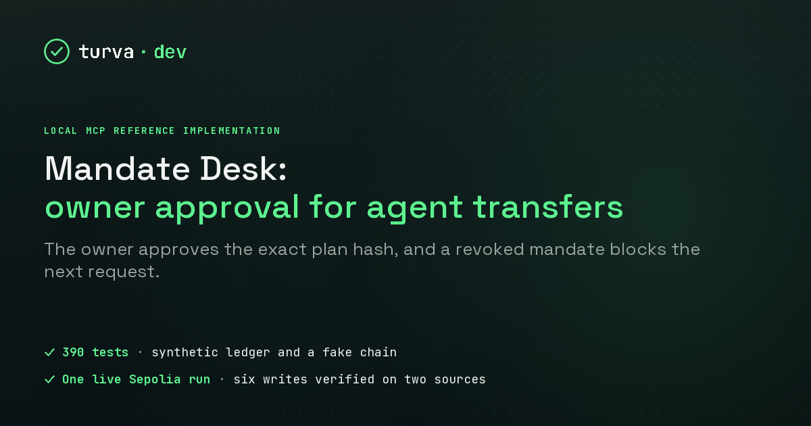

# Mandate Desk



Mandate Desk is a project by Erik Rekola. The card uses the wordmark and visual style of turva.dev, his agent-readiness audit business.

Mandate Desk lets an owner set transfer limits, review an agent's request and approve its exact contents. The agent can prepare requests and execute an approved plan. Owner approval and revocation stay in the owner workspace.

This repository contains a working local MDT simulation, a separate offline preparation workspace for Ethereum Sepolia and the code of a live Sepolia run. The simulation uses a synthetic ledger. The Sepolia workspace builds unsigned transaction previews from fixtures. Its signer is unavailable unless the server and the live MCP server are started with --live. One live run was made that way on 15 September 2026. Its evidence package is under verification/. The repository holds no signed bytes, no key and no hosted deployment.

The package version is 0.3.0-preview.1. The existing simulation MCP interface retains version 0.1.1. Earlier review verdicts apply to their original source snapshots, not automatically to this expanded code.

## Start the demo

Requirements are Windows, an existing PowerShell session and Node.js 24 or later. No dependency installation, API key, wallet or browser extension is required to run the application. Clone or download the repository, open PowerShell in its directory and run this one block:

```powershell
$ErrorActionPreference = 'Stop'
node .\tools\check-demo.mjs
if ($LASTEXITCODE -ne 0) { throw 'The package checks failed.' }
node .\tools\write-mcp-config.mjs
if ($LASTEXITCODE -ne 0) { throw 'MCP configuration could not be created.' }
& .\start-demo.ps1 -Port 4327 -Data '.local-demo'
```

Open [the owner workspace](http://127.0.0.1:4327/). The server binds only to this computer's loopback address. The launcher verifies the runtime, data path and server identity. It preserves occupied ports and existing application data. Generated state and MCP configuration stay in .local-demo inside the repository folder.

The [demo guide](DEMO.md) covers the complete sequence. The media folder includes an actual recorded canvas walkthrough of observed local API results. No microphone, camera or private desktop capture was used.

## Owner and agent workflow

The simulation starts with 1000 MDT, a limit of 60 MDT per transfer and a total limit of 100 MDT. The owner creates or revokes mandates. The agent prepares a request and runs preflight. The owner reviews its recipient, amount and plan hash before approval. Execution rechecks the current mandate and approval. Repeating an executed request with the same identity returns the existing receipt without another ledger change.

The example accepts 30 MDT, denies 80 MDT, accepts 50 MDT and denies 25 MDT. It then revokes the mandate and denies 1 MDT. These denials are enforced by local simulation policy. They have no blockchain transaction hash. Previous activity remains available when a new example starts.

The [Sepolia preparation workspace](http://127.0.0.1:4327/integration) displays the separate unsigned lifecycle. Its fixture recipient is the synthetic address 0x8888888888888888888888888888888888888888. Local preview approval does not authorize a chain write. Attempting execution without --live reports SIGNING_ROUTE_UNAVAILABLE. Fixture balances, nonces and fee settings are not a current chain preflight.

## Architecture and trust boundary

The browser and simulation MCP server share the same domain checks and persistent store. HTTP writes require a local session token and matching origin. The application offers no remote authentication or Internet-facing deployment mode.

The integration modules validate complete unsigned envelopes for setAction, token approval, grant, execute and revoke. Validation binds chain, signer, target, nonce, value, calldata, fee ceilings, validity and the trusted preparation hash. That expectation is rebuilt from the fixture and the approval. A changed persisted preparation cannot become trusted merely by recomputing its own hash. The HTTP preparation caller classifies every non-200 response before reading its body. A payment challenge never triggers payment.

The recovery journal separates pending, signed, broadcast, uncertain, confirmed and semantically verified states. It preserves transaction identity across retries. An unresolved broadcast permits only the same signed bytes after recovery checks. A nonce conflict stops. Semantic postchecks inspect transaction identity, receipt logs and the expected state transitions. The preview adapters consume typed fixture observations. The live adapter reads two RPC sources and requires the same block hash and the same confirmation depth from both before a step advances, and it requires the finalized tag from both before a run counts as complete evidence.

Local recipient and sender bindings must not be described as contract-enforced rules. The contract gates asset, action, limits, validity, revocation and freeze. Live operation still requires fresh API and independent chain evidence plus a separately authorized signing route.

The live path is in this repository as code. It adds an RPC client that reads two public Sepolia sources, a live plan pinned to integration/live-proposal.json, a signer process that unlocks two test keystores and keeps the API key in its own memory, a live adapter with two-source verification, one lock protocol for the three live lock files, and an evidence export with one completeness rule. The path was audited as round A1 on 14 September 2026 and every finding was fixed with a test. A second audit on 15 September 2026 checked the fixes and left three findings open with two design decisions, and a third round implemented them the same day. The lock is now an exclusive file handle that the operating system keeps for the life of the holding process. Each dependent write waits until both read sources return the earlier writes of the run at the required depth. The owner approves two hashes, the plan and the stable identity of the source code, and the owner, agent and signer processes check that identity again before each write-capable call. An independent re-check of the third round on 15 September 2026 left five findings open, and a fourth round implemented them the same day. The controls a write rests on are read again from both sources right before its bytes are signed, also for a preparation that was recorded before a failed signature. Cleanup resets only an allowance that the run's own writes left on chain. A process whose source bytes differ from the approved identity still follows a broadcast transaction by reads and records its receipt, but it never records a semantic result. The recording binding checks every member of the evidence package against its checksum and the package against the run's current blocks. The signer compares its code identity again inside its request queue before every preparation, signature and send. An independent re-check of the fourth round on 15 September 2026 left two findings open, and a fifth round implemented them the same day. The controls a write rests on are now read from both sources inside the signing step itself, after the last nonce reads and right before the signer is asked, so nothing awaited stands between that reading and the signature. Cleanup attributes the allowance on chain by the approval history of the owner and spender pair on both sources, so a later independent approval of the same amount is left in place and named. An independent re-check of the fifth round on 15 September 2026 closed both findings on that tree and left three refinements for the next round. The first live run on Sepolia was made the same day on Erik's decision, before that re-check was in. Three attempts stopped before any signature in the parser of Brickken's preparation response, which read the documented x402Requirements quote as a payment demand, then accepted it only as an object, then refused an undocumented executionMode echo. The parser now reads the quote as data in any JSON form, keeps it out of the transaction and the preparation hash and never pays, and it admits the echo only as client-signed. The fourth attempt completed with six writes verified on both read sources and four controls passed. Its evidence package is in verification/sepolia-live-c990e8a178b0/, exported as incomplete: one of the run's two read sources stopped reporting new finalized blocks the day before the run and had not recovered when the package was exported, so the two-source finality rule is not met, while the other source finalized every block of the run within its normal delay. The verification record names one more deviation: the last step was reached with a fetch throttle preload in the owner server process that is outside the code identity.

## MCP compatibility

The simulation was tested with the external Model Context Protocol Inspector 2.6.0 over stdio. Verification included discovery, planning, preflight, owner HTTP approval, execution, replay across client processes, revocation and receipt retrieval. The test used a separate temporary client configuration and memory-only secret storage.

The generated .local-demo/mcp-config.json defines three independent stdio servers. The simulation server exposes get_context, plan_transfers, preflight_plan, execute_approved_plan and get_receipt. The separate Sepolia preview server exposes get_context, plan_execute, preflight, execute_approved and get_receipt. The Sepolia live server exposes get_context, preflight, execute_approved and get_receipt, and its execute_approved signs and broadcasts the one owner-approved execute step when the server runs with --live. None of the three exposes owner approval, grant, revoke, a signer or a key as an agent tool. A client should launch the exact generated command and arguments. Compatibility with other MCP clients is unverified.

## Verification and distribution

See [verification results](VERIFICATION.md), [AI contribution disclosure](AI-DISCLOSURE.md), [license](LICENSE) and [third-party notices](THIRD-PARTY-NOTICES.md). The portable test runner explicitly selects public application and integration tests. It does not discover native wallet or historical evidence scripts.

This repository is the public source copy of a reviewed local package, and it has no public demo URL. The package's evidence reports and its local Git bundle stay outside the repository. The evidence package of the live run of 15 September 2026 is inside it, under verification/. The repository must not be represented as a completed live competition entry.
