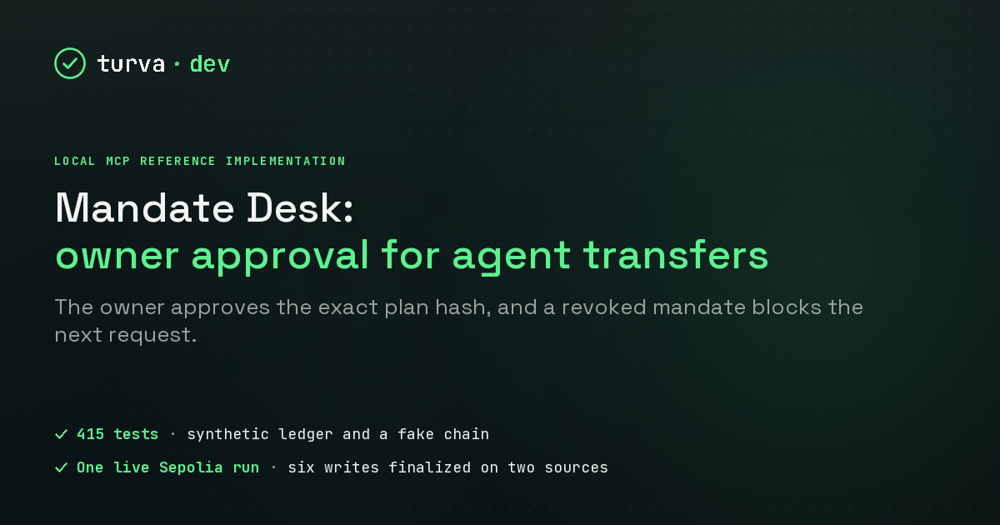

# Mandate Desk



An agent requests. The owner decides. Review an agent's exact transfer plan, approve it within fixed limits and revoke the mandate when its work is done. Mandate Desk separates the owner's approval from the agent's execution.

Demo with nothing to install: https://erekola.github.io/mandate-desk/

Mandate Desk is a project by Erik Rekola. The card uses the wordmark and visual style of turva.dev, his agent-readiness audit business.

Mandate Desk lets an owner set transfer limits, review an agent's request and approve its exact contents. The agent can prepare requests and execute an approved plan. Owner approval and revocation stay in the owner workspace.

This repository contains a working local MDT simulation, a separate offline preparation workspace for Ethereum Sepolia and the code of a live Sepolia run. The simulation uses a synthetic ledger. The Sepolia workspace builds unsigned transaction previews from fixtures. Its signer is unavailable unless the server and the live MCP server are started with --live. One live run was made that way on 15 September 2026. Its evidence package is under verification/. The repository holds no signed bytes, no live keystore and no API key, and it runs no hosted instance of the application. Its tests sign with the publicly known Hardhat development keys against fake chain observations.

## The demo page and the recording

The demo page plays the recorded walkthrough of the local simulation and links every transaction of the live Sepolia run to the block explorer. It is a static page. It makes no API call, asks for no wallet and sends no transaction, and it presents work done earlier rather than a new run. It is published from the gh-pages branch of this repository and it carries the published site alone.

The recording is the original 132 second walkthrough of observed local API results. No microphone, camera or private desktop capture was used. Its six chapter buttons pause the video at a named step, and captions and a transcript are on the page.

## Brickken integration on Ethereum Sepolia

The [Sepolia preparation workspace](http://127.0.0.1:4327/integration) displays the separate unsigned lifecycle. Its fixture recipient is the synthetic address 0x8888888888888888888888888888888888888888. Local preview approval does not authorize a chain write. Attempting execution without --live reports SIGNING_ROUTE_UNAVAILABLE. Fixture balances, nonces and fee settings are not a current chain preflight.

The integration modules validate complete unsigned envelopes for setAction, token approval, grant, execute and revoke. Validation binds chain, signer, target, nonce, value, calldata, fee ceilings, validity and the trusted preparation hash. That expectation is rebuilt from the fixture and the approval. A changed persisted preparation cannot become trusted merely by recomputing its own hash. The HTTP preparation caller classifies every non-200 response before reading its body. The live calls to the Brickken RAMS API make one exception: on HTTP 400 they read at most 8192 bytes of the body and keep only a short machine error code. A payment challenge never triggers payment.

Local recipient and sender bindings must not be described as contract-enforced rules. The contract gates asset, action, limits, validity, revocation and freeze. Live operation still requires fresh API and independent chain evidence plus a separately authorized signing route.

## The live run of 15 September 2026

The first live run on Sepolia was made on Erik's decision on the tree of the fifth fix round, before that round's independent re-check was in. Three attempts stopped before any signature in the parser of Brickken's preparation response, which read the documented x402Requirements quote as a payment demand, then accepted it only as an object, then refused an undocumented executionMode echo. The parser now reads the quote as data, keeps only its documented fields in a bounded form, keeps it out of the transaction and the preparation hash and never pays, and it admits the echo only as client-signed.

The fourth attempt completed with six writes verified on both read sources and four controls passed. Four of the six went through the Brickken RAMS API and the two ERC-20 steps went through a Sepolia RPC. Its evidence package is in verification/sepolia-live-c990e8a178b0/ and it is complete under the run's own rule: both read sources report every block of the run as finalized. One of them had stopped reporting new finalized blocks the day before the run and recovered by 12:12 UTC, under four hours after the last write, so a first export was marked incomplete and was replaced. A recording of the live evidence page, bound by the server to the run and to that package, is in media/. The verification record names one deviation of the run: the last step was reached with a fetch throttle preload in the owner server process that is outside the code identity.

## Start it locally

Requirements are Windows, an existing PowerShell session and Node.js 24 or later. No dependency installation, API key, wallet or browser extension is required to run the application. Clone or download the repository, open PowerShell in its directory and run this one block:

```powershell
$ErrorActionPreference = 'Stop'
node .\tools\check-demo.mjs
if ($LASTEXITCODE -ne 0) { throw 'The package checks failed.' }
node .\tools\write-mcp-config.mjs
if ($LASTEXITCODE -ne 0) { throw 'MCP configuration could not be created.' }
& .\start-demo.ps1 -Port 4327 -Data '.local-demo'
```

Open [the owner workspace](http://127.0.0.1:4327/). The server binds only to this computer's loopback address. The launcher verifies the runtime, data path and server identity. It preserves occupied ports and existing application data. Generated state and MCP configuration stay in .local-demo inside the repository folder.

The [demo guide](demo.md) covers the complete sequence.

The simulation starts with 1000 MDT, a limit of 60 MDT per transfer and a total limit of 100 MDT. The owner creates or revokes mandates. The agent prepares a request and runs preflight. The owner reviews its recipient, amount and plan hash before approval. Execution rechecks the current mandate and approval. Repeating an executed request with the same identity returns the existing receipt without another ledger change.

The example accepts 30 MDT, denies 80 MDT, accepts 50 MDT and denies 25 MDT. It then revokes the mandate and denies 1 MDT. These denials are enforced by local simulation policy. They have no blockchain transaction hash. Previous activity remains available when a new example starts.

## MCP compatibility

The simulation was tested with the external Model Context Protocol Inspector 2.6.0 over stdio. Verification included discovery, planning, preflight, owner HTTP approval, execution, replay across client processes, revocation and receipt retrieval. The test used a separate temporary client configuration and memory-only secret storage.

The generated .local-demo/mcp-config.json defines three independent stdio servers. The simulation server exposes get_context, plan_transfers, preflight_plan, execute_approved_plan and get_receipt. The separate Sepolia preview server exposes get_context, plan_execute, preflight, execute_approved and get_receipt. The Sepolia live server exposes get_context, preflight, execute_approved and get_receipt and its execute_approved signs and broadcasts the one owner-approved execute step when the server runs with --live. None of the three exposes owner approval, grant, revoke, a signer or a key as an agent tool. A client should launch the exact generated command and arguments. Compatibility with other MCP clients is unverified.

## Limits, and what this repository is not

Three dates keep this apart, because the repository has meant three different things.

On 14 September 2026 this repository was published as the public source copy of a reviewed local package, with no live run behind it. The reservation written then said that the repository must not be represented as a completed live competition entry, and that reservation belongs to that state of the work.

On 15 September 2026 one live run completed on Ethereum Sepolia and its evidence package went into the repository under verification/. The run is real and anyone can check it. It does not make the project production ready. One run on a test network, under the conditions of one day, is not evidence that the design is safe, and every review round so far has returned something: findings in the earlier rounds, and three refinements in the re-check of the fifth.

The source now in this repository is a later revision than the one that made that run. The run keeps its own code identity and its disclosed preload deviation, and test results from the later revision do not apply to it retroactively. Earlier review verdicts apply to their original source snapshots, not automatically to this expanded code.

That reservation still holds in its own terms. This repository is a source copy and an evidence package, and it is not a completed or a decided competition entry. Publishing the demo page changed neither the application source, the main branch nor the submission entry.

The trust boundary itself is narrow. The browser and simulation MCP server share the same domain checks and persistent store. HTTP writes require a local session token and matching origin. The application offers no remote authentication and no Internet-facing deployment mode, and the demo page named above is a static page rather than a hosted instance of the application.

The recovery journal separates pending, signed, broadcast, uncertain, confirmed and semantically verified states. It preserves transaction identity across retries. An unresolved broadcast permits only the same signed bytes after recovery checks. A nonce conflict stops. Semantic postchecks inspect transaction identity, receipt logs and the expected state transitions. The preview adapters consume typed fixture observations. The live adapter reads two RPC sources and requires the same block hash and the same confirmation depth from both before a step advances and it requires the finalized tag from both before a run counts as complete evidence.

## Development history

The live path is in this repository as code. It adds an RPC client that reads two public Sepolia sources, a live plan pinned to integration/live-proposal.json, a signer process that decrypts two test keystores and keeps the API key in its own memory, a live adapter with two-source verification, one lock protocol for the three live lock files and an evidence export with one completeness rule. The path was audited as round A1 on 14 September 2026 and every finding was fixed with a test. A second audit on 15 September 2026 checked the fixes and made two corrections. An independent re-check the same day left three findings open with two design decisions, and a third round implemented them the same day.

The lock is now an exclusive file handle that the operating system keeps for the life of the holding process. Each dependent write waits until both read sources return the earlier writes of the run at the required depth. The owner approves two hashes, the plan and the stable identity of the source code and the owner, agent and signer processes check that identity again before each write-capable call.

An independent re-check of the third round on 15 September 2026 left five findings open and a fourth round implemented them the same day. The controls a write rests on are read again from both sources right before its bytes are signed, also for a preparation that was recorded before a failed signature. Cleanup resets only an allowance that the run's own writes left on chain. A process whose source bytes differ from the approved identity still follows a broadcast transaction by reads and records its receipt, but it never records a semantic result. The recording binding checks every member of the evidence package against its checksum and the package against the run's current blocks. The signer compares its code identity again inside its request queue before every preparation, signature and send.

An independent re-check of the fourth round on 15 September 2026 left two findings open and a fifth round implemented them the same day. The controls a write rests on are now read from both sources inside the signing step itself, after the last nonce reads and right before the signer is asked, followed by the ownership and code-identity check before the signer request. Cleanup attributes the allowance on chain by the approval history of the owner and spender pair on both sources, so a later independent approval of the same amount is left in place and named.

An independent re-check of the fifth round on 15 September 2026 closed both findings on that tree and left three refinements for the next round.

The correction for fix round 5 adds bounded HTTP 429 retries for allowlisted RPC reads and serializes those reads per source. Dependency block reads finish before tip reads begin. The evidence exporter includes the cleanup origin checks and reset refusals when present, including an incomplete cleanup export. The event query accepts at most 100000 blocks, counting both endpoints. The preparation parsers also accept an explicitly null quote beside a data envelope.

The demo guide now specifies the second execute_approved call required by the recorded live walkthrough and explains recovery from ALLOWANCE_NOT_ZERO. The public verification record lists the cleanup evidence and its reason values. These corrections are a separate source revision. They do not change the first run's approval, its original code identity or the disclosed owner-process preload deviation.

A repository hardening on 24 September 2026 closed the open items of two repository reviews from 19 and 22 September 2026. Each item has a test. Every file of an evidence package is now checked against a closed field schema for its kind, and the export writes the package only after every file has passed. A lock path that is a link, a junction or a second name of another file stops the live lock. The signer endpoint record counts only in its exact format and only when it names the reading process's code identity. Two different x402 quotes in one preparation response stop the run with QUOTE_CONFLICT. SECURITY.md describes the trust boundary and how to report a vulnerability, and GitHub Actions runs the test suite on Windows for every push and pull request. This revision has its own code identity and leaves the evidence of the first run as it was.

A second hardening on 27 September 2026 closed the items of an outside hostile audit of 26 September 2026. Every live control also requires the mandate on chain to match the approved grant, and the owner's revocation checks the same before it signs. Every evidence file must carry the fields its kind requires, and each receipt's transaction hash must match the journal. An x402 quote of any other shape stops the run with X402_QUOTE_SHAPE before the conflict check. The signer writes its token files readable by their owner only where the file system honours file modes, and `vendor/ethers-6.17.0/` carries a component list and a manual advisory check.

## Verification and distribution

See [verification results](verification.md), [security policy](SECURITY.md), [AI contribution disclosure](ai-disclosure.md), [license](LICENSE) and [third-party notices](third-party-notices.md). The portable test runner explicitly selects public application and integration tests. It does not discover native wallet or historical evidence scripts.

The package's evidence reports and its local Git bundle stay outside the repository. The evidence package of the live run of 15 September 2026 is inside it, under verification/. The demo page is published from the gh-pages branch of this repository and it serves the recording and that evidence package, not a running instance of the application.
